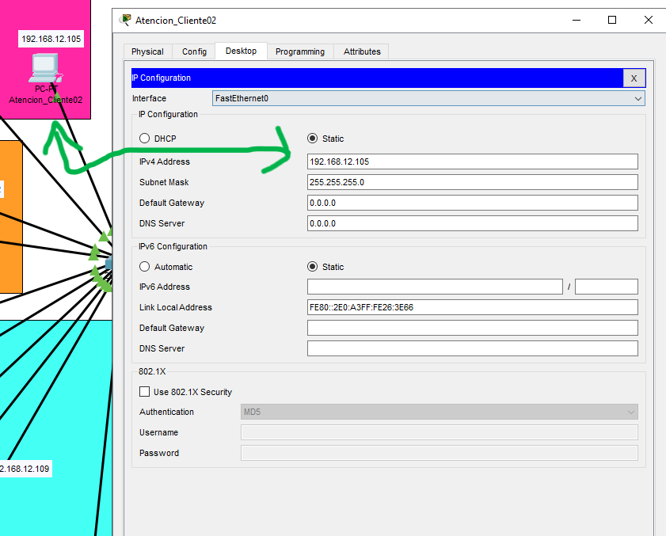
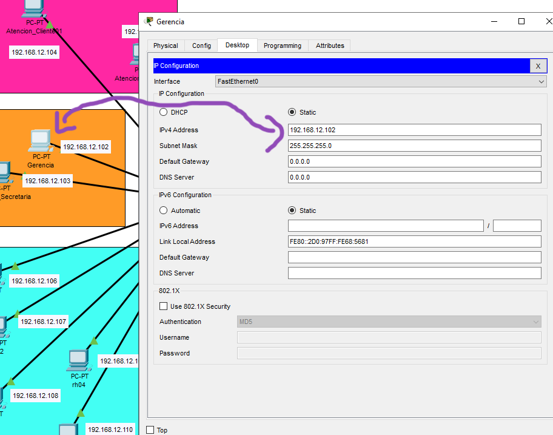
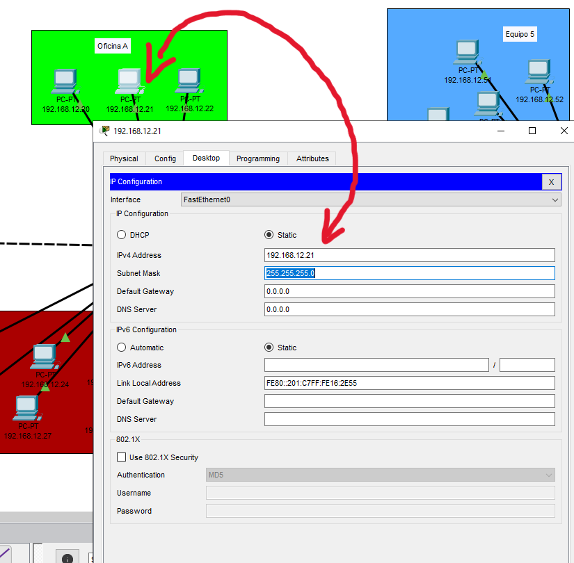
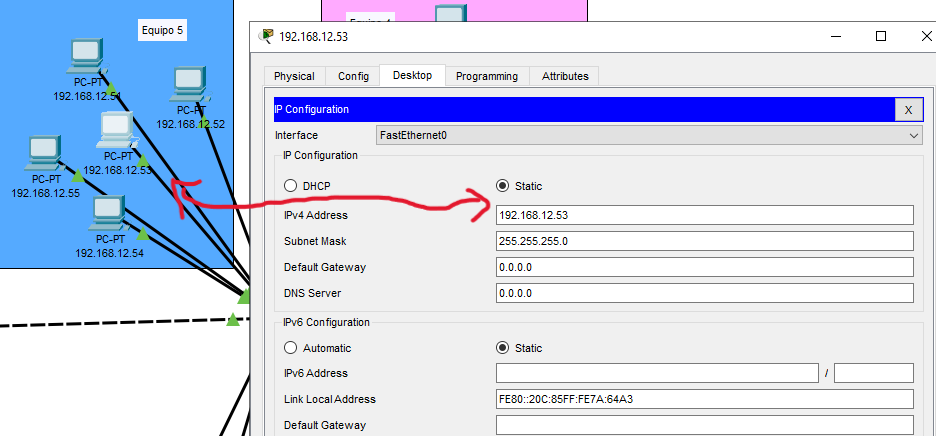
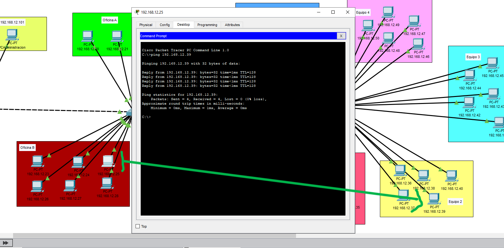

# Manual Técnico

## Introducción

Este manual técnico está diseñado para guiar a los estudiantes en la realización de la Práctica 1 del curso de Redes de Computadoras 1, impartido en la Facultad de Ingeniería de la Universidad de San Carlos de Guatemala. La práctica tiene como objetivo principal evaluar los conocimientos adquiridos en clase, específicamente en la creación y configuración de una red local utilizando herramientas y protocolos esenciales como Ethernet, IP, ARP e ICMP.

En este contexto, se plantea un escenario en el que los estudiantes deben diseñar y configurar una red para un pequeño negocio de tres niveles, utilizando el software Packet Tracer. Este manual proporcionará las instrucciones necesarias para la correcta implementación de la topología de red en estrella, la asignación de direcciones IP, y la verificación de la conectividad entre los diferentes dispositivos de la red. Además, se incluye una guía sobre cómo capturar y analizar paquetes de red utilizando el modo simulación de Packet Tracer, lo cual es fundamental para comprobar la correcta operación de la red configurada.

El manual se estructura de manera que los estudiantes puedan seguir paso a paso el proceso de configuración, con el objetivo de asegurar que todos los componentes de la red estén correctamente identificados y conectados, y que la red funcione de acuerdo con las especificaciones solicitadas. Este documento es, por lo tanto, una herramienta clave para completar la práctica de manera exitosa y demostrar la competencia técnica requerida en el ámbito de las redes de computadoras.

## Configuración 

### Configuración de VPC's

Se utilizó para la configuración de red 192.168.xx.x0 en donde las primeras xx son la suma del último dígito de los carnets de los integrantes

Los carnets son 201532643, 201906051 y 201800918 quedando como las primeras xx el valor de 12 (8 + 1 + 3 => 12) y la última x sería el nivel (para el caso del nivel 3 como no existen ip's mayores a 255 se utilizarán valores arriba de 39 también)

#### Configuración Nivel 1

> Se configuro el VPC de Administración para tener la ip 192.168.12.101


> Se configuro el VPC de atención al cliente 2 con la ip 192.168.12.105



> Se configuro el VPC de atención al cliente 2 con la ip 192.168.12.102



#### Configuración Nivel 2

> Se configuro el VPC de la Oficina A con la ip 192.168.12.21



> Se configuro el VPC de la Oficina B con la ip 192.168.12.23


> Se configuro el VPC de la Oficina C con la ip 192.168.12.200


#### Configuración Nivel 3

> Se configuro el VPC de la Equipo 1 con la ip 192.168.12.200


> Se configuro el VPC de la Equipo 2 con la ip 192.168.12.40


> Se configuro el VPC de la Equipo 3 con la ip 192.168.12.45


> Se configuro el VPC de la Equipo 5 con la ip 192.168.12.53



### Pings a Hosts (5 VPCs)

Se realizaron los siguientes pings a las vpcs

> Ping de Administración (192.168.12.101) a Oficina A (192.168.12.22)


> Ping de Gerencia (192.168.12.102) a Equipo 4 (192.168.12.49)


> Ping de Oficina A (192.168.12.20) a Recursos Humanos (192.168.12.109)


> Ping de Oficina B (192.168.12.25) a Equipo 2 (192.168.12.39)



> Ping de Equipo 4 (192.168.12.49) a Atención al Cliente (192.168.12.104)


### Demostración de la captura de un paquete ARP/ICMP

> Video

https://github.com/user-attachments/assets/85791b99-ca7a-42dc-958d-0eea9a60455b

> Capturas


### Comandos Utilizados

> Obtener ip
```bash
$ ipconfig
```

```bash
ping <ip-destino>
```