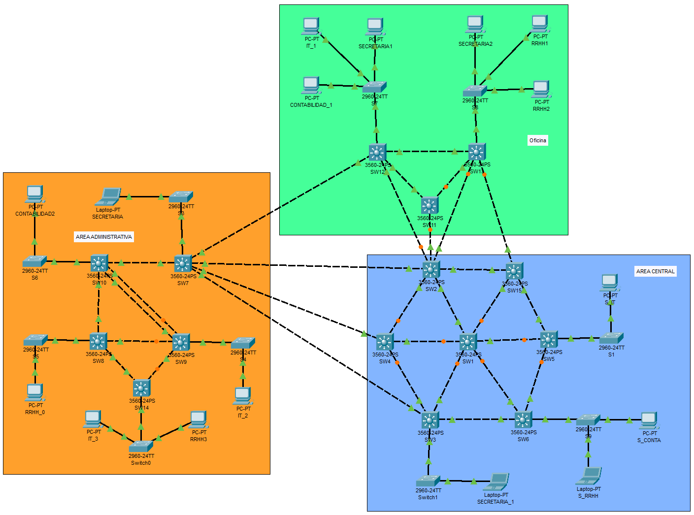

## Proyecto 1

| Nombre | Carnet | Usuario Git |
| :------ | :-------: | -------: |
| Carlos Jezeh Gedeoni Toscano Palacios   |   201532643   | [CarlosJezeh777](https://github.com/CarlosJezeh777) |
| Juan Francisco Urbina Silva  |   201906051   | [Iskandar1412](https://github.com/Iskandar1412) |
| Luis Eduardo Monroy Pérez  |   201800918   | [LempDnote](https://github.com/LempDnote) |

### Documentación 

Para este proyecto se utilizarán VLANS definidas de la siguiente manera:

|Departamento|VLAN|ID de red|
|RRHH|1X|192.168.1X.0/24|
|Secretaria|2X|192.168.2X.0/24|
|Contabilidad|3X|192.168.3X.0/24|
|IT|4X|192.168.4X.0/24|

Donde se utilizará la suma de el último dígito de todos los carnets (caso en el que sea mayor a 9 la suma, se tomará el último dígito de la suma)

* 3 + 1 + 8 => 12 > 9 --> 2

Se utilizará 2 para las definiciones

|Departamento|VLAN|ID de red|
|RRHH|12|192.168.12.0/24|
|Secretaria|22|192.168.22.0/24|
|Contabilidad|32|192.168.32.0/24|
|IT|42|192.168.42.0/24|

Tomar en cuenta que el `/24` hace referencia a la máscara de subred `255.255.255.0`

> Topología

