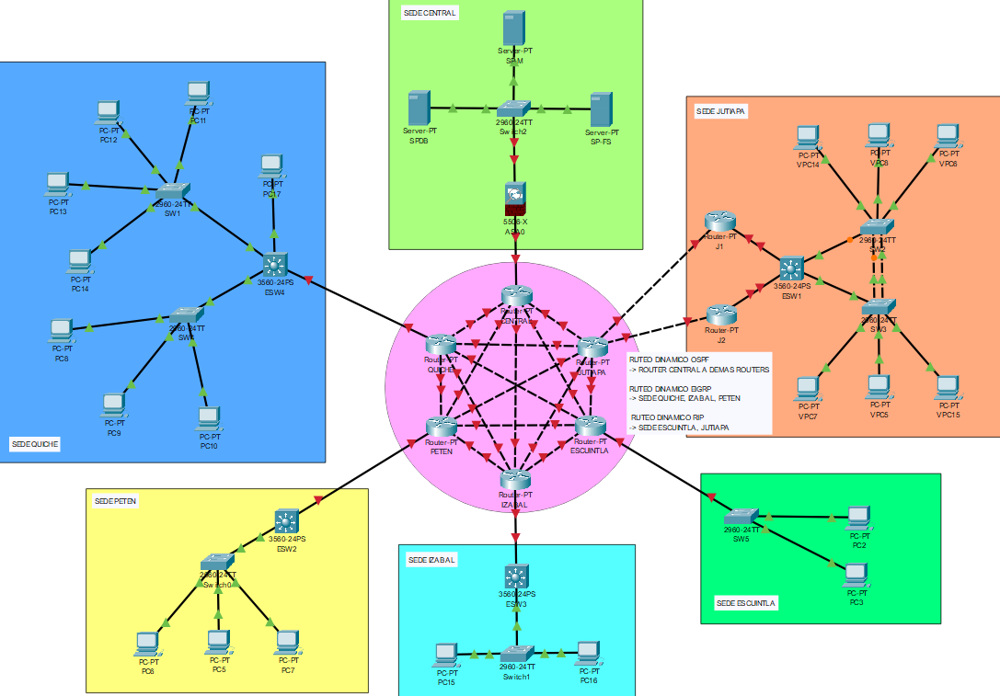

## Topología completa



## Cálculo VLSM (Variable Length Subnet Mask)

- Carnets

| No. Carnet |
| :---:      |
| 201532643  |
| 201800918  |
| 201906051  |

Para la sede de Jutiapa se Ejemplificará
### Jutiapa 
#### Paso 1: Ordenamiento

Las VLANs se van a organizar de acuerdo a la cantidad de equipos necesarios para cada una, se van a organizar de mayor a menor.

| VLAN         | ID de VLAN | Equipos |
| :---         | :---:      | ---:    |
| RRHH         | 1Y         | 10      |
| Contabilidad | 2Y         | 4       |
| Ventas       | 3Y         | 25      |
| Informatica  | 4Y         | 12      |

Donde Y es el último dígito del número de carnet con mayor denominación (En este caso sería el 8)

- Ordenados de mayor a menor (Equipos)

| VLAN         | ID de VLAN | Equipos |
| :---         | :---:      | ---:    |
| Ventas       | 38         | 25      |
| Informatica  | 48         | 12      |
| RRHH         | 18         | 10      |
| Contabilidad | 28         | 4       |

#### Paso 2: Asignación de Mascara y Wildcard

Es importante tener en cuenta que al definir la máscara de red es necesario determinar la cantidad de hosts que se desean para la red, para ello se debe considerar dos aspectos escenciales:

* La Parte de Red<br/>
* La Parte de Host

Es a través de la `Parte de Host` que se establece la cantidad de direcciones IP disponibles en la red, por lo que resulta crucial realizar cálculos para determinar adecuadamente la cantidad de hosts que la red podrá alojar.

> Para la VLAN `Ventas`

1. Calcular la cantidad de equipos de la `Parte de Host`

Para determinar la cantidad de equipos, se va a emplear la fórmula $2^2$. Se evaluarán varias opciones:

* Cuando $n = 3$, resulta en $2^3 =  8$ equipos.<br/>
* Cuando $n = 4$, resulta en $2^4 = 16$ equipos.<br/>
* Cuando $n = 5$, resulta en $2^5 = 32$ equipos.<br/>
* Cuando $n = 6$, resulta en $2^6 = 64$ equipos.<br/>

Luego de obtener dichos resultados, se determina que la opción que se adapta mejor a la cantidad de equipos que se requieren es $n = 5$.

Ventas       --> $Equipos = 25 -> 2^5$<br/>
Informatica  --> $Equipos = 12 -> 2^4$<br/>
RRHH         --> $Equipos = 10 -> 2^4$<br/>
Contabilidad --> $Equipos = 4  -> 2^3$<br/>

**N** Representa la cantidad de bits que se utilizan para identificar la `Parte de Host`.

2. Determinación de la cantidad de bits para la `Parte de Red`

Una vez calculado **N**, se procede a determinar la cantidad de bits utilizados para la `Parte de Red`. Dicho cálculo se realiza dde la siguiente manera:

Ventas       --> $32 - 5 = 27$ bits<br/>
Informatica  --> $32 - 4 = 28$ bits<br/>
RRHH         --> $32 - 4 = 28$ bits<br/>
Contabilidad --> $32 - 3 = 29$ bits<br/>

Por lo tanto, concluimos que la cantidad de bits para la `Parte de Red` es de 27 bits, lo que se expresa en **CIDR** como `/27`.

>> **Nota:** Se restan con 32 debido a que se está evaluuando una dirección IPv4, la cual consta de 32 bits.

3. Cálculo de la Máscara de Red (Decimal)

Dado que la dirección IP consta de 32 bits, estos se representan de la siguiente manera:

`Parte de Red` + `Parte de Host`

En este caso, la `Parte de Red` consta de 27 bits, se representa con unos (1's), mientras que la `Parte de Host`, con 5 bits, se representan con ceros (0's). En binario y decimal, sería de la siguiente manera.

$2^7 + 2^6 + 2^5 + 2^4 + 2^3 + 2^2 + 2^1 + 2^0 = 255$<br/>
$128 + 64 + 32 + 16 + 8 + 4 + 2 + 1 = 255$<br/>

* Ventas
$11111111.11111111.11111111.11100000 = 255.255.255.224$
* Informatica
$11111111.11111111.11111111.11110000 = 255.255.255.240$
* RRHH
$11111111.11111111.11111111.11110000 = 255.255.255.240$
* Contabilidad
$11111111.11111111.11111111.11111000 = 255.255.255.248$

Donde `11100000` sería $128 + 64 + 32 + 0 + 0 + 0 + 0 + 0 = 224$<br/>
Donde `11110000` sería $128 + 64 + 32 + 16 + 0 + 0 + 0 + 0 = 240$<br/>
Donde `11111000` sería $128 + 64 + 32 + 16 + 8 + 0 + 0 + 0 = 248$<br/>

Por lo que la máscara es **255.255.255.224**

4. Cálculo de Wildcard

Para realizar este cálculo, se deben utilizar exclusivamente la cantidad de equpos determinada en el **Paso 1**. 

Ventas       --> $255.255.255.255 - 255.255.255.224 = 31$<br/>
Informatica  --> $255.255.255.255 - 255.255.255.240 = 15$<br/>
RRHH         --> $255.255.255.255 - 255.255.255.240 = 15$<br/>
Contabilidad --> $255.255.255.255 - 255.255.255.248 = 7$<br/>

| VLAN         | ID de VLAN | Equipos | Máscara de Red  | Wildcard |
| :---         | :---:      | ---:    | :---:           | :---     |
| Ventas       | 38         | 25      | 255.255.255.224 | 0.0.0.31 |
| Informatica  | 48         | 12      | 255.255.255.240 | 0.0.0.15 |
| RRHH         | 18         | 10      | 255.255.255.240 | 0.0.0.15 |
| Contabilidad | 28         | 4       | 255.255.255.248 | 0.0.0.7  |

#### Paso 3: Asignación de ID Red, Primera IP, Última IP e IP Broadcast

Donde la Red Interna de jutiapa con el ID de red 192.168.XX.0/24 (XX número de grupo de desarrolladores de proyecto)

* Grupo 13

Por lo tanto `192.168.13.0/24`

1. Asignación de ID Red

    * Ventas
    Se asigna la red interna inicial (192.168.13.0) + 31 -> 0 + 31 = 31
    * Informatica
    Se asigna la red interna inicial (192.168.13.32) + 15 -> 32 + 15 = 47
    * RRHH
    Se asigna la red interna inicial (192.168.13.48) + 15 -> 48 + 15 = 63
    * Contabilidad
    Se asigna la red interna inicial (192.168.13.64) + 7 -> 64 + 7 = 71

2. Asignación de Primera IP

    * Ventas
    Sería la IP siguiente en la secuencia (192.168.13.1)
    * Informatica
    Sería la IP siguiente en la secuencia (192.168.13.33)
    * RRHH
    Sería la IP siguiente en la secuencia (192.168.13.49)
    * Contabilidad
    Sería la IP siguiente en la secuencia (192.168.13.65)

3. Asignación de Última IP

    * Ventas
    Sería (IP del Broadcast - 1) -> 192.168.13.30
    * Informatica
    Sería (IP del Broadcast - 1) -> 192.168.13.46
    * RRHH
    Sería (IP del Broadcast - 1) -> 192.168.13.62
    * Contabilidad
    Sería (IP del Broadcast - 1) -> 192.168.13.70

4. Asignación del Broadcast

    La dirección del broadcast es la última dirección IP asignable. Se determina por la cantidad de Host que hay disponibles.

    > **Nota:** Una forma para visualizar la cantidad de Host que se tienen es por medio del Wildcard

    * Ventas
    Sería (IP del Broadcast) -> 192.168.13.31
    * Informatica
    Sería (IP del Broadcast) -> 192.168.13.47
    * RRHH
    Sería (IP del Broadcast) -> 192.168.13.63
    * Contabilidad
    Sería (IP del Broadcast) -> 192.168.13.71

* Tabla con asignaciones de IP siguientes:

| VLAN         | ID de VLAN | Equipos | Máscara de Red  | Wildcard | ID Red        | Primera IP    | Última IP     | IP Broadcast  |
| :---         | :---:      | ---:    | :---:           | :---     | :---          | :---          | :---          | :---          |
| Ventas       | 38         | 25      | 255.255.255.224 | 0.0.0.31 | 192.168.13.0  | 192.168.13.1  | 192.168.13.30 | 192.168.13.31 |
| Informatica  | 48         | 12      | 255.255.255.240 | 0.0.0.15 | 192.168.13.32 | 192.168.13.33 | 192.168.13.46 | 192.168.13.47 |
| RRHH         | 18         | 10      | 255.255.255.240 | 0.0.0.15 | 192.168.13.48 | 192.168.13.49 | 192.168.13.62 | 192.168.13.63 |
| Contabilidad | 28         | 4       | 255.255.255.248 | 0.0.0.7  | 192.168.13.64 | 192.168.13.65 | 192.168.13.70 | 192.168.13.71 |

### Escuintla 
#### Paso 1: Ordenamiento

Las VLANs se van a organizar de acuerdo a la cantidad de equipos necesarios para cada una, se van a organizar de mayor a menor.

| VLAN         | ID de VLAN | Equipos |
| :---         | :---:      | ---:    |
| RRHH         | 1Y         | 5       |
| Ventas       | 3Y         | 20      |

Donde Y es el último dígito del número de carnet con mayor denominación (En este caso sería el 8)

- Ordenados de mayor a menor (Equipos)

| VLAN         | ID de VLAN | Equipos |
| :---         | :---:      | ---:    |
| Ventas       | 38         | 20      |
| RRHH         | 18         | 5       |

#### Paso 2: Asignación de Mascara y Wildcard

1. Calcular la cantidad de equipos de la `Parte de Host`

    * Cuando $n = 3$, resulta en $2^3 =  8$ equipos.<br/>
    * Cuando $n = 4$, resulta en $2^4 = 16$ equipos.<br/>
    * Cuando $n = 5$, resulta en $2^5 = 32$ equipos.<br/>
    * Cuando $n = 6$, resulta en $2^6 = 64$ equipos.<br/>

Ventas       --> $Equipos = 20 -> 2^5$<br/>
RRHH         --> $Equipos = 5  -> 2^3$<br/>

**N** Representa la cantidad de bits que se utilizan para identificar la `Parte de Host`.

2. Determinación de la cantidad de bits para la `Parte de Red`

Una vez calculado **N**, se procede a determinar la cantidad de bits utilizados para la `Parte de Red`. Dicho cálculo se realiza dde la siguiente manera:

Ventas       --> $32 - 5 = 27$ bits -> **CIDR::** `/27`<br/>
RRHH         --> $32 - 3 = 29$ bits -> **CIDR::** `/29`<br/>

>> **Nota:** Se restan con 32 debido a que se está evaluuando una dirección IPv4, la cual consta de 32 bits.

3. Cálculo de la Máscara de Red (Decimal)

Dado que la dirección IP consta de 32 bits, estos se representan de la siguiente manera:

$2^7 + 2^6 + 2^5 + 2^4 + 2^3 + 2^2 + 2^1 + 2^0 = 255$ <br/>
$128 + 64 + 32 + 16 + 8 + 4 + 2 + 1 = 255$<br/>

* Ventas
$11111111.11111111.11111111.11100000 = 255.255.255.224$
* RRHH
$11111111.11111111.11111111.11111000 = 255.255.255.248$

Donde `11100000` sería $128 + 64 + 32 + 0 + 0 + 0 + 0 + 0 = 224$<br/>
Donde `11111000` sería $128 + 64 + 32 + 16 + 8 + 0 + 0 + 0 = 248$<br/>

4. Cálculo de Wildcard

Para realizar este cálculo, se deben utilizar exclusivamente la cantidad de equpos determinada en el **Paso 1**. 

Ventas       --> $255.255.255.255 - 255.255.255.224 = 31$<br/>
RRHH         --> $255.255.255.255 - 255.255.255.248 = 7$<br/>

| VLAN         | ID de VLAN | Equipos | Máscara de Red  | Wildcard |
| :---         | :---:      | ---:    | :---:           | :---     |
| Ventas       | 38         | 25      | 255.255.255.224 | 0.0.0.31 |
| RRHH         | 18         | 10      | 255.255.255.248 | 0.0.0.7  |

#### Paso 3: Asignación de ID Red, Primera IP, Última IP e IP Broadcast

Donde la Red Interna de jutiapa con el ID de red 192.148.XX.0/24 (XX número de grupo de desarrolladores de proyecto)

* Grupo 13

Por lo tanto `192.148.13.0/24`

1. Asignación de ID Red

    * Ventas
    Se asigna la red interna inicial (192.148.13.0) + 31 -> 0 + 31 = 31
    * RRHH
    Se asigna la red interna inicial (192.148.13.32) + 7 -> 32 + 7 = 39

2. Asignación de Primera IP

    * Ventas
    Sería la IP siguiente en la secuencia (192.148.13.1)
    * RRHH
    Sería la IP siguiente en la secuencia (192.148.13.33)

3. Asignación de Última IP

    * Ventas
    Sería (IP del Broadcast - 1) -> 192.148.13.30
    * RRHH
    Sería (IP del Broadcast - 1) -> 192.148.13.38
    
4. Asignación del Broadcast

    La dirección del broadcast es la última dirección IP asignable. Se determina por la cantidad de Host que hay disponibles.

    > **Nota:** Una forma para visualizar la cantidad de Host que se tienen es por medio del Wildcard

    * Ventas
    Sería (IP del Broadcast) -> 192.148.13.31
    * RRHH
    Sería (IP del Broadcast) -> 192.148.13.39
    
* Tabla con asignaciones de IP siguientes:

| VLAN         | ID de VLAN | Equipos | Máscara de Red  | Wildcard | ID Red        | Primera IP    | Última IP     | IP Broadcast  |
| :---         | :---:      | ---:    | :---:           | :---     | :---          | :---          | :---          | :---          |
| Ventas       | 38         | 25      | 255.255.255.224 | 0.0.0.31 | 192.148.13.0  | 192.148.13.1  | 192.148.13.30 | 192.148.13.31 |
| RRHH         | 18         | 10      | 255.255.255.248 | 0.0.0.7  | 192.148.13.32 | 192.148.13.33 | 192.148.13.38 | 192.148.13.39 |

### Quiche 
#### Paso 1: Ordenamiento

Las VLANs se van a organizar de acuerdo a la cantidad de equipos necesarios para cada una, se van a organizar de mayor a menor.

| VLAN         | ID de VLAN | Equipos |
| :---         | :---:      | ---:    |
| RRHH         | 1Y         | 12      |
| Contabilidad | 2Y         | 10      |
| Ventas       | 3Y         | 36      |
| Informatica  | 4Y         | 21      |

Donde Y es el último dígito del número de carnet con mayor denominación (En este caso sería el 8)

- Ordenados de mayor a menor (Equipos)

| VLAN         | ID de VLAN | Equipos |
| :---         | :---:      | ---:    |
| Ventas       | 38         | 36      |
| Informatica  | 48         | 21      |
| RRHH         | 18         | 12      |
| Contabilidad | 28         | 10      |

#### Paso 2: Asignación de Mascara y Wildcard

1. Calcular la cantidad de equipos de la `Parte de Host`

    * Cuando $n = 3$, resulta en $2^3 =  8$ equipos.<br/>
    * Cuando $n = 4$, resulta en $2^4 = 16$ equipos.<br/>
    * Cuando $n = 5$, resulta en $2^5 = 32$ equipos.<br/>
    * Cuando $n = 6$, resulta en $2^6 = 64$ equipos.<br/>

Ventas       --> $Equipos = 36 -> 2^6$<br/>
Informatica  --> $Equipos = 21 -> 2^5$<br/>
RRHH         --> $Equipos = 12 -> 2^4$<br/>
Contabilidad --> $Equipos = 10 -> 2^4$<br/>

**N** Representa la cantidad de bits que se utilizan para identificar la `Parte de Host`.

2. Determinación de la cantidad de bits para la `Parte de Red`

Una vez calculado **N**, se procede a determinar la cantidad de bits utilizados para la `Parte de Red`. Dicho cálculo se realiza dde la siguiente manera:

Ventas       --> $32 - 6 = 26$ bits -> **CIDR::** `/26`<br/>
Informatica  --> $32 - 5 = 27$ bits -> **CIDR::** `/27`<br/>
RRHH         --> $32 - 4 = 28$ bits -> **CIDR::** `/28`<br/>
Contabilidad --> $32 - 4 = 28$ bits -> **CIDR::** `/28`<br/>

>> **Nota:** Se restan con 32 debido a que se está evaluuando una dirección IPv4, la cual consta de 32 bits.

3. Cálculo de la Máscara de Red (Decimal)

Dado que la dirección IP consta de 32 bits, estos se representan de la siguiente manera:

$2^7 + 2^6 + 2^5 + 2^4 + 2^3 + 2^2 + 2^1 + 2^0 = 255$<br/>
$128 + 64 + 32 + 16 + 8 + 4 + 2 + 1 = 255$<br/>

* Ventas
$11111111.11111111.11111111.11000000 = 255.255.255.192$
* Informatica
$11111111.11111111.11111111.11100000 = 255.255.255.224$
* RRHH
$11111111.11111111.11111111.11110000 = 255.255.255.240$
* Contabilidad
$11111111.11111111.11111111.11110000 = 255.255.255.240$

Donde `11000000` sería $128 + 64 + 0 + 0 + 0 + 0 + 0 + 0 = 192$<br/>
Donde `11100000` sería $128 + 64 + 32 + 0 + 0 + 0 + 0 + 0 = 224$<br/>
Donde `11110000` sería $128 + 64 + 32 + 16 + 0 + 0 + 0 + 0 = 240$<br/>

4. Cálculo de Wildcard

Para realizar este cálculo, se deben utilizar exclusivamente la cantidad de equpos determinada en el **Paso 1**. 

Ventas       --> $255.255.255.255 - 255.255.255.192 = 63$<br/>
Informatica  --> $255.255.255.255 - 255.255.255.224 = 31$<br/>
RRHH         --> $255.255.255.255 - 255.255.255.240 = 15$<br/>
Contabilidad --> $255.255.255.255 - 255.255.255.240 = 15$<br/>

| VLAN         | ID de VLAN | Equipos | Máscara de Red  | Wildcard |
| :---         | :---:      | ---:    | :---:           | :---     |
| Ventas       | 38         | 36      | 255.255.255.192 | 0.0.0.63 |
| Informatica  | 48         | 21      | 255.255.255.224 | 0.0.0.31 |
| RRHH         | 18         | 12      | 255.255.255.240 | 0.0.0.15 |
| Contabilidad | 28         | 10      | 255.255.255.240 | 0.0.0.15 |

#### Paso 3: Asignación de ID Red, Primera IP, Última IP e IP Broadcast

Donde la Red Interna de jutiapa con el ID de red 192.178.XX.0/24 (XX número de grupo de desarrolladores de proyecto)

* Grupo 13

Por lo tanto `192.178.13.0/24`

1. Asignación de ID Red

    * Ventas
    Se asigna la red interna inicial (192.178.13.0) + 63 -> 0 + 63 = 63
    * Informatica
    Se asigna la red interna inicial (192.178.13.64) + 31 -> 64 + 31 = 95
    * RRHH
    Se asigna la red interna inicial (192.178.13.96) + 15 -> 96 + 15 = 111
    * Contabilidad
    Se asigna la red interna inicial (192.178.13.112) + 15 -> 112 + 7 = 127

2. Asignación de Primera IP

    * Ventas
    Sería la IP siguiente en la secuencia (192.178.13.1)
    * Informatica
    Sería la IP siguiente en la secuencia (192.178.13.65)
    * RRHH
    Sería la IP siguiente en la secuencia (192.178.13.97)
    * Contabilidad
    Sería la IP siguiente en la secuencia (192.178.13.113)

3. Asignación de Última IP

    * Ventas
    Sería (IP del Broadcast - 1) -> 192.178.13.62
    * Informatica
    Sería (IP del Broadcast - 1) -> 192.178.13.94
    * RRHH
    Sería (IP del Broadcast - 1) -> 192.178.13.110
    * Contabilidad
    Sería (IP del Broadcast - 1) -> 192.178.13.126
    
4. Asignación del Broadcast

    La dirección del broadcast es la última dirección IP asignable. Se determina por la cantidad de Host que hay disponibles.

    > **Nota:** Una forma para visualizar la cantidad de Host que se tienen es por medio del Wildcard

    * Ventas
    Sería (IP del Broadcast) -> 192.178.13.63
    * Informatica
    Sería (IP del Broadcast) -> 192.178.13.95
    * RRHH
    Sería (IP del Broadcast) -> 192.178.13.111
    * Contabilidad
    Sería (IP del Broadcast) -> 192.178.13.127
    
* Tabla con asignaciones de IP siguientes:

| VLAN         | ID de VLAN | Equipos | Máscara de Red  | Wildcard | ID Red         | Primera IP     | Última IP      | IP Broadcast   |
| :---         | :---:      | ---:    | :---:           | :---     | :---           | :---           | :---           | :---           |
| Ventas       | 38         | 36      | 255.255.255.192 | 0.0.0.63 | 192.178.13.0   | 192.178.13.1   | 192.178.13.62  | 192.178.13.63  |
| Informatica  | 48         | 21      | 255.255.255.224 | 0.0.0.31 | 192.178.13.64  | 192.178.13.65  | 192.178.13.94  | 192.178.13.95  |
| RRHH         | 18         | 12      | 255.255.255.240 | 0.0.0.15 | 192.178.13.96  | 192.178.13.97  | 192.178.13.110 | 192.178.13.111 |
| Contabilidad | 28         | 10      | 255.255.255.240 | 0.0.0.15 | 192.178.13.112 | 192.178.13.113 | 192.178.13.126 | 192.178.13.127 |

### Petén 
#### Paso 1: Ordenamiento

Las VLANs se van a organizar de acuerdo a la cantidad de equipos necesarios para cada una, se van a organizar de mayor a menor.

| VLAN         | ID de VLAN | Equipos |
| :---         | :---:      | ---:    |
| RRHH         | 1Y         | 10      |
| Ventas       | 3Y         | 30      |
| Informatica  | 4Y         | 15      |

Donde Y es el último dígito del número de carnet con mayor denominación (En este caso sería el 8)

- Ordenados de mayor a menor (Equipos)

| VLAN         | ID de VLAN | Equipos |
| :---         | :---:      | ---:    |
| Ventas       | 38         | 30      |
| Informatica  | 48         | 15      |
| RRHH         | 18         | 10      |

#### Paso 2: Asignación de Mascara y Wildcard

1. Calcular la cantidad de equipos de la `Parte de Host`

    * Cuando $n = 3$, resulta en $2^3 =  8$ equipos.<br/>
    * Cuando $n = 4$, resulta en $2^4 = 16$ equipos.<br/>
    * Cuando $n = 5$, resulta en $2^5 = 32$ equipos.<br/>
    * Cuando $n = 6$, resulta en $2^6 = 64$ equipos.<br/>

Ventas       --> $Equipos = 30 -> 2^5$<br/>
Informatica  --> $Equipos = 15 -> 2^5$<br/>
RRHH         --> $Equipos = 10 -> 2^4$<br/>

**N** Representa la cantidad de bits que se utilizan para identificar la `Parte de Host`.

2. Determinación de la cantidad de bits para la `Parte de Red`

Una vez calculado **N**, se procede a determinar la cantidad de bits utilizados para la `Parte de Red`. Dicho cálculo se realiza dde la siguiente manera:

Ventas       --> $32 - 5 = 27$ bits -> **CIDR::** `/27`<br/>
Informatica  --> $32 - 5 = 27$ bits -> **CIDR::** `/27`<br/>
RRHH         --> $32 - 4 = 28$ bits -> **CIDR::** `/28`<br/>

>> **Nota:** Se restan con 32 debido a que se está evaluuando una dirección IPv4, la cual consta de 32 bits.

3. Cálculo de la Máscara de Red (Decimal)

Dado que la dirección IP consta de 32 bits, estos se representan de la siguiente manera:

$2^7 + 2^6 + 2^5 + 2^4 + 2^3 + 2^2 + 2^1 + 2^0 = 255$<br/>
$128 + 64 + 32 + 16 + 8 + 4 + 2 + 1 = 255$<br/>

* Ventas
$11111111.11111111.11111111.11100000 = 255.255.255.224$<br/>
* Informatica
$11111111.11111111.11111111.11100000 = 255.255.255.224$<br/>
* RRHH
$11111111.11111111.11111111.11110000 = 255.255.255.240$<br/>

Donde `11100000` sería $128 + 64 + 32 + 0 + 0 + 0 + 0 + 0 = 224$<br/>
Donde `11110000` sería $128 + 64 + 32 + 16 + 0 + 0 + 0 + 0 = 240$<br/>

4. Cálculo de Wildcard

Para realizar este cálculo, se deben utilizar exclusivamente la cantidad de equpos determinada en el **Paso 1**. 

Ventas       --> $255.255.255.255 - 255.255.255.224 = 31$<br/>
Informatica  --> $255.255.255.255 - 255.255.255.224 = 31$<br/>
RRHH         --> $255.255.255.255 - 255.255.255.240 = 15$<br/>

| VLAN         | ID de VLAN | Equipos | Máscara de Red  | Wildcard |
| :---         | :---:      | ---:    | :---:           | :---     |
| Ventas       | 38         | 30      | 255.255.255.224 | 0.0.0.31 |
| Informatica  | 48         | 15      | 255.255.255.224 | 0.0.0.31 |
| RRHH         | 18         | 10      | 255.255.255.240 | 0.0.0.15 |

#### Paso 3: Asignación de ID Red, Primera IP, Última IP e IP Broadcast

Donde la Red Interna de jutiapa con el ID de red 192.158.XX.0/24 (XX número de grupo de desarrolladores de proyecto)

* Grupo 13

Por lo tanto `192.158.13.0/24`

1. Asignación de ID Red

    * Ventas
    Se asigna la red interna inicial (192.158.13.0) + 31 -> 0 + 31 = 31
    * Informatica
    Se asigna la red interna inicial (192.158.13.32) + 31 -> 32 + 31 = 63
    * RRHH
    Se asigna la red interna inicial (192.158.13.64) + 15 -> 64 + 15 = 79

2. Asignación de Primera IP

    * Ventas
    Sería la IP siguiente en la secuencia (192.158.13.1)
    * Informatica
    Sería la IP siguiente en la secuencia (192.158.13.33)
    * RRHH
    Sería la IP siguiente en la secuencia (192.158.13.65)

3. Asignación de Última IP

    * Ventas
    Sería (IP del Broadcast - 1) -> 192.158.13.30
    * Informatica
    Sería (IP del Broadcast - 1) -> 192.158.13.62
    * RRHH
    Sería (IP del Broadcast - 1) -> 192.158.13.78
    
4. Asignación del Broadcast

    La dirección del broadcast es la última dirección IP asignable. Se determina por la cantidad de Host que hay disponibles.

    > **Nota:** Una forma para visualizar la cantidad de Host que se tienen es por medio del Wildcard

    * Ventas
    Sería (IP del Broadcast) -> 192.158.13.31
    * Informatica
    Sería (IP del Broadcast) -> 192.158.13.63
    * RRHH
    Sería (IP del Broadcast) -> 192.158.13.79
    
* Tabla con asignaciones de IP siguientes:

| VLAN         | ID de VLAN | Equipos | Máscara de Red  | Wildcard | ID Red        | Primera IP    | Última IP     | IP Broadcast  |
| :---         | :---:      | ---:    | :---:           | :---     | :---          | :---          | :---          | :---          |
| Ventas       | 38         | 30      | 255.255.255.224 | 0.0.0.31 | 192.158.13.0  | 192.158.13.1  | 192.158.13.30 | 192.158.13.31 |
| Informatica  | 48         | 15      | 255.255.255.224 | 0.0.0.31 | 192.158.13.32 | 192.158.13.33 | 192.158.13.62 | 192.158.13.63 |
| RRHH         | 18         | 10      | 255.255.255.240 | 0.0.0.15 | 192.158.13.64 | 192.158.13.65 | 192.158.13.78 | 192.158.13.79 |

### Izabal 
#### Paso 1: Ordenamiento

Las VLANs se van a organizar de acuerdo a la cantidad de equipos necesarios para cada una, se van a organizar de mayor a menor.

| VLAN         | ID de VLAN | Equipos |
| :---         | :---:      | ---:    |
| RRHH         | 1Y         | 10      |
| Contabilidad | 2Y         | 5       |
| Ventas       | 3Y         | 25      |

Donde Y es el último dígito del número de carnet con mayor denominación (En este caso sería el 8)

- Ordenados de mayor a menor (Equipos)

| VLAN         | ID de VLAN | Equipos |
| :---         | :---:      | ---:    |
| Ventas       | 38         | 25      |
| RRHH         | 18         | 10      |
| Contabilidad | 28         | 5       |

#### Paso 2: Asignación de Mascara y Wildcard

1. Calcular la cantidad de equipos de la `Parte de Host`

    * Cuando $n = 3$, resulta en $2^3 =  8$ equipos.<br/>
    * Cuando $n = 4$, resulta en $2^4 = 16$ equipos.<br/>
    * Cuando $n = 5$, resulta en $2^5 = 32$ equipos.<br/>
    * Cuando $n = 6$, resulta en $2^6 = 64$ equipos.<br/>

Ventas       --> $Equipos = 25 -> 2^5$<br/>
RRHH         --> $Equipos = 10 -> 2^4$<br/>
Contabilidad --> $Equipos = 5  -> 2^3$<br/>

**N** Representa la cantidad de bits que se utilizan para identificar la `Parte de Host`.

2. Determinación de la cantidad de bits para la `Parte de Red`

Una vez calculado **N**, se procede a determinar la cantidad de bits utilizados para la `Parte de Red`. Dicho cálculo se realiza dde la siguiente manera:

Ventas       --> $32 - 5 = 27$ bits -> **CIDR::** `/27`<br/>
RRHH         --> $32 - 4 = 28$ bits -> **CIDR::** `/28`<br/>
Contabilidad --> $32 - 3 = 29$ bits -> **CIDR::** `/29`<br/>

>> **Nota:** Se restan con 32 debido a que se está evaluuando una dirección IPv4, la cual consta de 32 bits.

3. Cálculo de la Máscara de Red (Decimal)

Dado que la dirección IP consta de 32 bits, estos se representan de la siguiente manera:

$2^7 + 2^6 + 2^5 + 2^4 + 2^3 + 2^2 + 2^1 + 2^0 = 255$<br/>
$128 + 64 + 32 + 16 + 8 + 4 + 2 + 1 = 255$<br/>

* Ventas
$11111111.11111111.11111111.11100000 = 255.255.255.224$
* RRHH
$11111111.11111111.11111111.11110000 = 255.255.255.240$
* Contabilidad
$11111111.11111111.11111111.11111000 = 255.255.255.248$

Donde `11100000` sería $128 + 64 + 32 + 0 + 0 + 0 + 0 + 0 = 224$<br/>
Donde `11110000` sería $128 + 64 + 32 + 16 + 0 + 0 + 0 + 0 = 240$<br/>
Donde `11111000` sería $128 + 64 + 32 + 16 + 8 + 0 + 0 + 0 = 248$<br/>

4. Cálculo de Wildcard

Para realizar este cálculo, se deben utilizar exclusivamente la cantidad de equpos determinada en el **Paso 1**. 

Ventas       --> $255.255.255.255 - 255.255.255.224 = 31$<br/>
RRHH         --> $255.255.255.255 - 255.255.255.240 = 15$<br/>
Contabilidad --> $255.255.255.255 - 255.255.255.248 = 7$<br/>

| VLAN         | ID de VLAN | Equipos | Máscara de Red  | Wildcard |
| :---         | :---:      | ---:    | :---:           | :---     |
| Ventas       | 38         | 25      | 255.255.255.224 | 0.0.0.31 |
| RRHH         | 18         | 10      | 255.255.255.240 | 0.0.0.15 |
| Contabilidad | 28         | 5       | 255.255.255.248 | 0.0.0.7  |

#### Paso 3: Asignación de ID Red, Primera IP, Última IP e IP Broadcast

Donde la Red Interna de jutiapa con el ID de red 192.167.XX.0/24 (XX número de grupo de desarrolladores de proyecto)

* Grupo 13

Por lo tanto `192.167.13.0/24`

1. Asignación de ID Red

    * Ventas
    Se asigna la red interna inicial (192.167.13.0) + 31 -> 0 + 31 = 31
    * RRHH
    Se asigna la red interna inicial (192.167.13.32) + 15 -> 32 + 15 = 47
    * Contabilidad
    Se asigna la red interna inicial (192.167.13.48) + 7 -> 48 + 7 = 55

2. Asignación de Primera IP

    * Ventas
    Sería la IP siguiente en la secuencia (192.167.13.1)
    * RRHH
    Sería la IP siguiente en la secuencia (192.167.13.33)
    * Contabilidad
    Sería la IP siguiente en la secuencia (192.167.13.49)

3. Asignación de Última IP

    * Ventas
    Sería (IP del Broadcast - 1) -> 192.167.13.30
    * RRHH
    Sería (IP del Broadcast - 1) -> 192.167.13.46
    * Contabilidad
    Sería (IP del Broadcast - 1) -> 192.167.13.54
    
4. Asignación del Broadcast

    La dirección del broadcast es la última dirección IP asignable. Se determina por la cantidad de Host que hay disponibles.

    > **Nota:** Una forma para visualizar la cantidad de Host que se tienen es por medio del Wildcard

    * Ventas
    Sería (IP del Broadcast) -> 192.167.13.31
    * RRHH
    Sería (IP del Broadcast) -> 192.167.13.47
    * Contabilidad
    Sería (IP del Broadcast) -> 192.167.13.55
    
* Tabla con asignaciones de IP siguientes:

| VLAN         | ID de VLAN | Equipos | Máscara de Red  | Wildcard | ID Red        | Primera IP    | Última IP     | IP Broadcast  |
| :---         | :---:      | ---:    | :---:           | :---     | :---          | :---          | :---          | :---          |
| Ventas       | 38         | 25      | 255.255.255.224 | 0.0.0.31 | 192.167.13.0  | 192.167.13.1  | 192.167.13.30 | 192.167.13.31 |
| RRHH         | 18         | 10      | 255.255.255.240 | 0.0.0.15 | 192.167.13.32 | 192.167.13.33 | 192.167.13.46 | 192.167.13.47 |
| Contabilidad | 28         | 5       | 255.255.255.248 | 0.0.0.7  | 192.167.13.48 | 192.167.13.49 | 192.167.13.54 | 192.167.13.55 |

----- 

### Sede Jutiapa

* ID Red = 192.168.XX.0/24

Grupo 13 (192.168.13.0/24)

| VLAN         | ID de VLAN | Equipos | Máscara de Red  | Wildcard | ID Red        | Primera IP    | Última IP     | IP Broadcast  |
| :---         | :---:      | ---:    | :---:           | :---     | :---          | :---          | :---          | :---          |
| Ventas       | 38         | 25      | 255.255.255.224 | 0.0.0.31 | 192.168.13.0  | 192.168.13.1  | 192.168.13.30 | 192.168.13.31 |
| Informatica  | 48         | 12      | 255.255.255.240 | 0.0.0.15 | 192.168.13.32 | 192.168.13.33 | 192.168.13.46 | 192.168.13.47 |
| RRHH         | 18         | 10      | 255.255.255.240 | 0.0.0.15 | 192.168.13.48 | 192.168.13.49 | 192.168.13.62 | 192.168.13.63 |
| Contabilidad | 28         | 4       | 255.255.255.248 | 0.0.0.7  | 192.168.13.64 | 192.168.13.65 | 192.168.13.70 | 192.168.13.71 |

### Sede Escuintla

* ID Red = 192.148.XX.0/24

Grupo 13 (192.148.13.0/24)

| VLAN         | ID de VLAN | Equipos | Máscara de Red  | Wildcard | ID Red        | Primera IP    | Última IP     | IP Broadcast  |
| :---         | :---:      | ---:    | :---:           | :---     | :---          | :---          | :---          | :---          |
| Ventas       | 38         | 25      | 255.255.255.224 | 0.0.0.31 | 192.148.13.0  | 192.148.13.1  | 192.148.13.30 | 192.168.13.31 |
| RRHH         | 18         | 10      | 255.255.255.248 | 0.0.0.7  | 192.148.13.32 | 192.148.13.33 | 192.148.13.38 | 192.168.13.39 |

### Sede Quiche

* ID Red = 192.178.XX.0/24

Grupo 13 (192.178.13.0/24)

| VLAN         | ID de VLAN | Equipos | Máscara de Red  | Wildcard | ID Red         | Primera IP     | Última IP      | IP Broadcast   |
| :---         | :---:      | ---:    | :---:           | :---     | :---           | :---           | :---           | :---           |
| Ventas       | 38         | 36      | 255.255.255.192 | 0.0.0.63 | 192.178.13.0   | 192.178.13.1   | 192.178.13.62  | 192.168.13.63  |
| Informatica  | 48         | 21      | 255.255.255.224 | 0.0.0.31 | 192.178.13.64  | 192.178.13.65  | 192.178.13.94  | 192.168.13.95  |
| RRHH         | 18         | 12      | 255.255.255.240 | 0.0.0.15 | 192.178.13.96  | 192.178.13.97  | 192.178.13.110 | 192.168.13.111 |
| Contabilidad | 28         | 10      | 255.255.255.240 | 0.0.0.15 | 192.178.13.112 | 192.178.13.113 | 192.178.13.126 | 192.168.13.127 |

### Sede Petén

* ID Red = 192.158.XX.0/24

Grupo 13 (192.158.13.0/24)

| VLAN         | ID de VLAN | Equipos | Máscara de Red  | Wildcard | ID Red        | Primera IP    | Última IP     | IP Broadcast  |
| :---         | :---:      | ---:    | :---:           | :---     | :---          | :---          | :---          | :---          |
| Ventas       | 38         | 30      | 255.255.255.224 | 0.0.0.31 | 192.158.13.0  | 192.158.13.1  | 192.158.13.30 | 192.158.13.31 |
| Informatica  | 48         | 15      | 255.255.255.224 | 0.0.0.31 | 192.158.13.32 | 192.158.13.33 | 192.158.13.62 | 192.158.13.63 |
| RRHH         | 18         | 10      | 255.255.255.240 | 0.0.0.15 | 192.158.13.64 | 192.158.13.65 | 192.158.13.78 | 192.158.13.79 |

### Sede Izabal

* ID Red = 192.167.XX.0/24

Grupo 13 (192.167.13.0/24)

| VLAN         | ID de VLAN | Equipos | Máscara de Red  | Wildcard | ID Red        | Primera IP    | Última IP     | IP Broadcast  |
| :---         | :---:      | ---:    | :---:           | :---     | :---          | :---          | :---          | :---          |
| Ventas       | 38         | 25      | 255.255.255.224 | 0.0.0.31 | 192.167.13.0  | 192.167.13.1  | 192.167.13.30 | 192.167.13.31 |
| RRHH         | 18         | 10      | 255.255.255.240 | 0.0.0.15 | 192.167.13.32 | 192.167.13.33 | 192.167.13.46 | 192.167.13.47 |
| Contabilidad | 28         | 5       | 255.255.255.248 | 0.0.0.7  | 192.167.13.48 | 192.167.13.49 | 192.167.13.54 | 192.167.13.55 |

## FLSM Obtenidos (Cálculo)
Se pondra máscará para todos los equipos /29 y esa ba definido por cada router que cada uno es una subred (255.255.255.240)

### Router CENTRAL
0-7
| Interfaz          | IP Red    | Máscara Red     |
| :---              | :---      | :---:           |
| fa5/0 (IZABAL)    | 10.0.0.1  | 255.255.255.248 |
| fa6/0 (PETEN)     | 10.0.0.9  | 255.255.255.248 |
| fa7/0 (ESCUINTLA) | 10.0.0.17 | 255.255.255.248 | 
| fa8/0 (JUTIAPA)   | 10.0.0.25 | 255.255.255.248 |
| fa9/0 (QUICHE)    | 10.0.0.33 | 255.255.255.248 |
| gi4/0 (ASA0)      | 10.0.0.X  | 255.255.255.248 |

### Router JUTIAPA
8-15
| Interfaz          | IP Red    | Máscara Red     |
| :---              | :---      | :---:           |
| fa0/0 (J2)        | 10.0.0.X  | 255.255.255.248 |
| fa1/0 (J1)        | 10.0.0.X  | 255.255.255.248 |
| fa5/0 (PETEN)     | 10.0.0.41 | 255.255.255.248 |
| fa6/0 (IZABAL)    | 10.0.0.49 | 255.255.255.248 |
| fa7/0 (QUICHE)    | 10.0.0.57 | 255.255.255.248 |
| fa8/0 (ESCUINTLA) | 10.0.0.65 | 255.255.255.248 |
| fa9/0 (CENTRAL)   | 10.0.0.26 | 255.255.255.248 |

### Router QUICHE
16-23
| Interfaz          | IP Red    | Máscara Red     |
| :---              | :---      | :---:           |
| fa0/0 (ESW4)      | 10.0.0.X  | 255.255.255.248 |
| fa5/0 (ESCUINTLA) | 10.0.0.73 | 255.255.255.248 |
| fa6/0 (IZABAL)    | 10.0.0.81 | 255.255.255.248 |
| fa7/0 (JUTIAPA)   | 10.0.0.58 | 255.255.255.248 |
| fa8/0 (PETEN)     | 10.0.0.89 | 255.255.255.248 |
| fa9/0 (CENTRAL)   | 10.0.0.34 | 255.255.255.248 |

### Router PETEN
24-31
| Interfaz          | IP Red     | Máscara Red     |
| :---              | :---       | :---:           |
| fa0/0 (ESW2)      | 10.0.0.X   | 255.255.255.248 |
| fa5/0 (JUTIAPA)   | 10.0.0.42  | 255.255.255.248 |
| fa6/0 (CENTRAL)   | 10.0.0.10  | 255.255.255.248 |
| fa7/0 (ESCUINTLA) | 10.0.0.97  | 255.255.255.248 |
| fa8/0 (QUICHE)    | 10.0.0.90  | 255.255.255.248 |
| fa9/0 (IZABAL)    | 10.0.0.105 | 255.255.255.248 |

### Router ESCUINTLA
32-39
| Interfaz          | IP Red     | Máscara Red     |
| :---              | :---       | :---:           |
| fa0/0 (SW5)       | 10.0.0.X   | 255.255.255.248 |
| fa5/0 (QUICHE)    | 10.0.0.74  | 255.255.255.248 |
| fa6/0 (CENTRAL)   | 10.0.0.18  | 255.255.255.248 |
| fa7/0 (PETEN)     | 10.0.0.98  | 255.255.255.248 |
| fa8/0 (JUTIAPA)   | 10.0.0.66  | 255.255.255.248 |
| fa9/0 (IZABAL)    | 10.0.0.113 | 255.255.255.248 |

### Router IZABAL
40-47
| Interfaz          | IP Red     | Máscara Red     |
| :---              | :---       | :---:           |
| fa0/0 (ESW3)      | 10.0.0.X   | 255.255.255.248 |
| fa5/0 (CENTRAL)   | 10.0.0.2   | 255.255.255.248 |
| fa6/0 (JUTIAPA)   | 10.0.0.50  | 255.255.255.248 |
| fa7/0 (QUICHE)    | 10.0.0.82  | 255.255.255.248 |
| fa8/0 (PETEN)     | 10.0.0.106 | 255.255.255.248 |
| fa9/0 (ESCUINTLA) | 10.0.0.114 | 255.255.255.248 |

## Configuraciones Router

#### Configuraciones Básicas

```
enable
conf t
no ip domain-lookup
hostname <Nombre_Dispositivo>
do wr -- puede ser end -> do copy running-config startup config
```

### Área CENTRAL
#### Switches
##### 2960-24TT (Switch2)
```

```

#### 5506-X (ASA0)

```

```

### Área JUTIAPA
#### Switches
##### 3560-24PS (ESW1)
```
-- Creación VLAN
vlan 18
name RRHH
vlan 28
name CONTABILIDAD
vlan 38
name VENTAS
vlan 48
name INFORMATICA
exit
do wr
```

```
-- Configuración del protocolo
vtp version 2
vtp mode server
vtp domain G13
vtp password usac
do wr
```

```
-- Configuración modo truncal
int range fa0/21 - 22
switchport trunk encapsulation dot1q
switchport mode trunk
no shutdown
exit
do wr

-- Envio vlans a router
int range fa0/23 - 24
switchport trunk encapsulation dot1q
switchport mode trunk
switchport trunk allowed vlan 1,18,28,38,48
exit
do wr
```

```
-- Configuración STP (RPVSTP)
spanning-tree mode rapid-pvst
do wr
```

##### 2960-24TT (SW2)
```
-- Configuración modo truncal
int fa0/22
switchport mode trunk
exit
do wr
```

```
-- Conciguración protocolo
vtp mode client
vtp domain G13
vtp password usac
do wr
```

```
-- Modo Acceso
--- Asignación VLANS Arbitrariamente
# VPC14
int fa0/1
switchport mode access
switchport access vlan 18
exit
do wr

# VPC8
int fa0/2
switchport mode access
switchport access vlan 28
exit
do wr

# VPC6
int fa0/3
switchport mode access
switchport access vlan 38
exit
do wr
```

- SW2 - SW3 (LACP)
```
int range fa0/23 - 24
channel-protocol lacp
channel-group 1 mode active
switchport mode trunk
no shut
exit

int port-channel 1
switchport mode trunk
no shut
exit
do wr 
```

```
-- Configuración STP (RRVST)
spanning-tree mode rapid-pvst
do wr
```

##### 2960-24TT (SW3)
```
-- Configuración modo truncal
int fa0/22
switchport mode trunk
exit
do wr
```

```
-- Conciguración protocolo
vtp mode client
vtp domain G13
vtp password usac
do wr
```

```
-- Modo Acceso
--- Asignación VLANS Arbitrariamente
# VPC7
int fa0/1
switchport mode access
switchport access vlan 48
exit
do wr

# VPC5
int fa0/2
switchport mode access
switchport access vlan 18
exit
do wr

# VPC15
int fa0/3
switchport mode access
switchport access vlan 28
exit
do wr
```

- SW2 - SW3 (LACP)
```
int range fa0/23 - 24
channel-protocol lacp
channel-group 1 mode active
switchport mode trunk
no shut
exit

int port-channel 1
switchport mode trunk
no shut
exit
do wr 
```

```
-- Configuración STP (RRVST)
spanning-tree mode rapid-pvst
do wr
```

#### Router
##### Router-PT (J1)
```
-- HSRP
int fa1/0
ip address 192.168.13.2 255.255.255.0
standby 10 ip 192.168.13.1
standby 10 priority 110
standby 10 preempt
no shutdown
exit
do wr
```

```
-- Configuración de IP y Máscara en cada puerto correspondiente
int fa0/0
ip address 11.0.0.1 255.255.255.252
no shut
exit
do wr
-- EL DE JUTIAPA DEBERIA DAR ALGO ASI 
int fa(que da a J1)
ip address 11.0.0.2 255.255.255.252
```

##### Router-PT (J2)
```
-- HSRP
int fa1/0
ip address 192.168.13.3 255.255.255.0
standby 10 ip 192.168.13.1
standby 10 priority 100
standby 10 preempt
no shutdown
exit
do wr
```

```
-- Configuración de IP y Máscara en cada puerto correspondiente
int fa0/0
ip address 11.0.0.5 255.255.255.252
no shut
exit
do wr
-- EL DE JUTIAPA DEBERIA DAR ALGO ASI 
int fa(que da a J2)
ip address 11.0.0.6 255.255.255.252
```

### Área ESCUINTLA
#### Switches
##### 2960-24TT (SW5)

```
-- Creación VLAN's
vlan 18
name RRHH
vlan 38
name VENTAS
exit
do wr
```

```
-- Configuración modo truncal
int fa0/24
switchport mode trunk
switchport trunk allowed vlan 1,18,38
exit
do wr
```

```
-- Configuración modo Acceso
# PC2
int fa0/1
switchport mode access
switchport access vlan 18
exit

# PC3
int fa0/2
switchport mode access
switchport access vlan 38
exit
do wr
```

```
-- Configuración STP (RPVST)
spanning-tree mode rapid-pvst
exit
```

### Área IZABAL
#### Switches
##### 3560-24PS (ESW3)
```
-- Creación VLAN
vlan 18
name RRHH
vlan 28
name CONTABILIDAD
vlan 38
name VENTAS
exit
do wr
```

```
-- Configuración del protocolo
vtp version 2
vtp mode server
vtp domain G13
vtp password usac
do wr
```

```
-- Configuración modo truncal
int fa23
switchport trunk encapsulation dot1q
switchport mode trunk
no shut
exit
do wr

-- Envio vlans a router
int fa0/24
switchport tunk encapsulation dot1q
switchport mode trunk
switchport trunk allowed vlan 1,18,28,38
exit
do wr
```

```
-- Configuración STP (RPVSTP)
spanning-tree mode rapid-pvst
do wr
```

##### 2960-24TT (Switch1)
```
-- Configuración modo truncal
int fa0/24
switchport mode trunk
exit
do wr
```

```
-- Conciguración protocolo
vtp mode client
vtp domain G13
vtp password usac
do wr
```

```
-- Modo Acceso
--- Asignación VLANS Arbitrariamente
# PC15
int fa0/1
switchport mode access
switchport access vlan 18
exit
do wr

# PC16
int fa0/2
switchport mode access
switchport access vlan 38
exit
do wr
```

```
-- Configuración STP (RRVST)
spanning-tree mode rapid-pvst
do wr
```

### Área PETÉN
#### Switches
##### 3560-24PS (ESW2)
```
-- Creación VLAN
vlan 18
name RRHH
vlan 38
name VENTAS
vlan 48
name INFORMATICA
exit
do wr
```

```
-- Configuración del protocolo
vtp version 2
vtp mode server
vtp domain G13
vtp password usac
do wr
```

```
-- Configuración modo truncal
int fa0/23
switchport trunk encapsulation dot1q
switchport mode trunk
no shutdown
exit
do wr

-- Envio vlans a router
int fa0/24
switchport trunk encapsulation dot1q
switchport mode trunk
switchport trunk allowed vlan 1,18,38,48
```

```
-- Configuración STP (RPVSTP)
spanning-tree mode rapid-pvst
do wr
```

##### 2960-24TT (Switch0)
```
-- Configuración modo truncal
int fa0/24
switchport mode trunk
exit
do wr
```

```
-- Conciguración protocolo
vtp mode client
vtp domain G13
vtp password usac
do wr
```

```
-- Modo Acceso
--- Asignación VLANS Arbitrariamente
# VPC6
int fa0/1
switchport mode access
switchport access vlan 18
exit
do wr

# VPC5
int fa0/2
switchport mode access
switchport access vlan 38
exit
do wr

# VPC7
int fa0/3
switchport mode access
switchport access vlan 48
exit
do wr
```

```
-- Configuración STP (RRVST)
spanning-tree mode rapid-pvst
do wr
```

### Área QUICHE
#### Switches
##### 3560-24PS (ESW4)
```
-- Creación VLAN
vlan 18
name RRHH
vlan 28
name CONTABILIDAD
vlan 38
name VENTAS
vlan 48
name INFORMATICA
exit
do wr
```

```
-- Configuración del protocolo
vtp version 2
vtp mode server
vtp domain G13
vtp password usac
do wr
```

```
-- Configuración modo truncal
int range fa0/22 - 23
switchport trunk encapsulation dot1q
switchport mode trunk
no shutdown
exit
do wr

-- Envio vlans a router
int fa0/24
switchport trunk encapsulation dot1q
switchport mode trunk
switchport trunk allowed vlan 1,18,28,38,48
exit 
do wr
```

```
-- Modo Acceso
--- Asignación VLANS Arbitrariamente
# PC17
int fa0/1
switchport mode access
switchport access vlan 48
exit
do wr
```

```
-- Configuración STP (RRVST)
spanning-tree mode rapid-pvst
do wr
```

##### 2960-24TT (SW1)
```
-- Configuración modo truncal
int fa0/24
switchport mode trunk
exit
do wr
```

```
-- Conciguración protocolo
vtp mode client
vtp domain G13
vtp password usac
do wr
```

```
-- Modo Acceso
--- Asignación VLANS Arbitrariamente
# VPC11
int fa0/1
switchport mode access
switchport access vlan 28
exit
do wr

# VPC12
int fa0/2
switchport mode access
switchport access vlan 18
exit
do wr

# VPC13
int fa0/3
switchport mode access
switchport access vlan 38
exit
do wr

# VPC14
int fa0/4
switchport mode access
switchport access vlan 48
exit
do wr
```

```
-- Configuración STP (RRVST)
spanning-tree mode rapid-pvst
do wr
```


##### 2960-24TT (SW4)
```
-- Configuración modo truncal
int fa0/24
switchport mode trunk
exit
do wr
```

```
-- Conciguración protocolo
vtp mode client
vtp domain G13
vtp password usac
do wr
```

```
-- Modo Acceso
--- Asignación VLANS Arbitrariamente
# VPC8
int fa0/1
switchport mode access
switchport access vlan 18
exit
do wr

# VPC9
int fa0/2
switchport mode access
switchport access vlan 28
exit
do wr

# VPC10
int fa0/3
switchport mode access
switchport access vlan 38
exit
do wr
```

```
-- Configuración STP (RRVST)
spanning-tree mode rapid-pvst
do wr
```

### ÁREA CORE (CONFIGURACIÓN)
#### ROUTER-PT
##### CENTRAL
```
-- Configuración puertos y Máscara
# IZABAL
int fa5/0
ip address 10.0.0.1 255.255.255.248
no shut
exit
do wr

# PETEN
int fa6/0
ip address 10.0.0.9 255.255.255.248
no shut
exit
do wr

# ESCUINTLA
int fa7/0
ip address 10.0.0.17 255.255.255.248
no shut
exit
do wr

# JUTIAPA
int fa8/0
ip address 10.0.0.25 255.255.255.248
no shut
exit
do wr

# QUICHE
int fa9/0
ip address 10.0.0.33 255.255.255.248
no shut
exit
do wr

# QUICHE
int gi4/0
ip address 10.0.0.41 255.255.255.248
no shut
exit
do wr
```

##### JUTIAPA
```
-- Configuración puertos y Máscara
# J2
int fa0/0
ip address 10.0.0.49 255.255.255.248
no shut
exit
do wr

# J1
int fa1/0
ip address 10.0.0.57 255.255.255.248
no shut
exit
do wr

# PETEN
int fa5/0
ip address 10.0.0.65 255.255.255.248
no shut
exit
do wr

# IZABAL
int fa6/0
ip address 10.0.0.73 255.255.255.248
no shut
exit
do wr

# QUICHE
int fa7/0
ip address 10.0.0.81 255.255.255.248
no shut
exit
do wr

# ESCUINTLA
int fa8/0
ip address 10.0.0.89 255.255.255.248
no shut
exit
do wr

# CENTRAL
int fa9/0
ip address 10.0.0.26 255.255.255.248
no shut
exit
do wr
```

##### QUICHE
```
-- Configuración puertos y Máscara
# ESW4
int fa0/0
ip address 10.0.0.97 255.255.255.248
no shut
exit
do wr

# ESCUINTLA
int fa5/0
ip address 10.0.0.105 255.255.255.248
no shut
exit
do wr

# IZABAL
int fa6/0
ip address 10.0.1.113 255.255.255.248
no shut
exit
do wr

# JUTIAPA
int fa7/0
ip address 10.0.1.82 255.255.255.248
no shut
exit
do wr

# PETEN
int fa8/0
ip address 10.0.1.121 255.255.255.248
no shut
exit
do wr

# CENTRAL
int fa9/0
ip address 10.0.1.34 255.255.255.248
no shut
exit
do wr
```

##### PETEN
```
-- Configuración puertos y Máscara
# ESW2
int fa0/0
ip address 10.0.1.129 255.255.255.248
no shut
exit
do wr

# JUTIAPA
int fa5/0
ip address 10.0.1.66 255.255.255.248
no shut
exit
do wr

# CENTRAL
int fa6/0
ip address 10.0.1.10 255.255.255.248
no shut
exit
do wr

# ESCUINTLA
int fa7/0
ip address 10.0.1.137 255.255.255.248
no shut
exit
do wr

# QUICHE
int fa8/0
ip address 10.0.1.122 255.255.255.248
no shut
exit
do wr

# IZABAL
int fa9/0
ip address 10.0.1.145 255.255.255.248
no shut
exit
do wr
```

##### ESCUINTLA
```
-- Configuración puertos y Máscara
# SW5
int fa0/0
ip address 10.0.1.153 255.255.255.248
no shut
exit
do wr

# QUICHE
int fa5/0
ip address 10.0.1.106 255.255.255.248
no shut
exit
do wr

# CENTRAL
int fa6/0
ip address 10.0.1.18 255.255.255.248
no shut
exit
do wr

# PETEN
int fa7/0
ip address 10.0.1.138 255.255.255.248
no shut
exit
do wr

# JUTIAPA
int fa8/0
ip address 10.0.1.90 255.255.255.248
no shut
exit
do wr

# IZABAL
int fa9/0
ip address 10.0.2.161 255.255.255.248
no shut
exit
do wr
```

##### IZABAL
```
-- Configuración puertos y Máscara
# ESW3
int fa0/0
ip address 10.0.0.169 255.255.255.248
no shut
exit
do wr

# CENTRAL
int fa5/0
ip address 10.0.0.2 255.255.255.248
no shut
exit
do wr

# JUTIAPA
int fa6/0
ip address 10.0.0.74 255.255.255.248
no shut
exit
do wr

# QUICHE
int fa7/0
ip address 10.0.0.114 255.255.255.248
no shut
exit
do wr

# PETEN
int fa8/0
ip address 10.0.0.146 255.255.255.248
no shut
exit
do wr

# ESCUINTLA
int fa9/0
ip address 10.0.0.162 255.255.255.248
no shut
exit
do wr
```